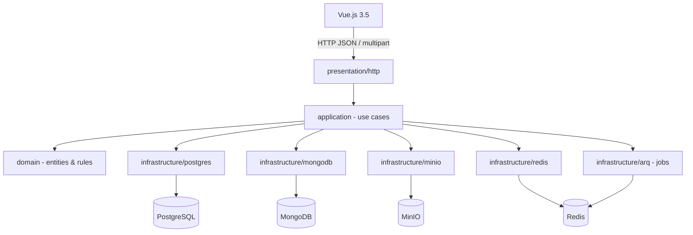
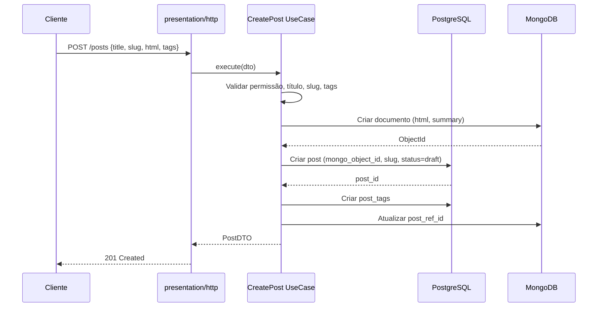
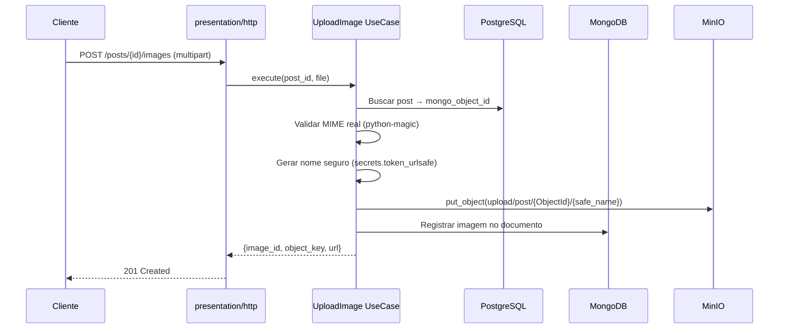

# SDD — Backend CMS FastAPI (Arquitetura Hexagonal)

> **Status geral:** ✅ Projeto implementado (v0.1.0)
> | Módulo | Status |
> |---|---|
> | Setup do Projeto | ✅ |
> | PostgreSQL + Alembic | ✅ |
> | MongoDB + Motor | ✅ |
> | Tags (CRUD) | ✅ |
> | Posts (CRUD + dual persistence) | ✅ |
> | Auth + MFA + RBAC | ✅ |
> | MinIO Upload | ✅ |
> | Redis + Rate Limit + ARQ | ✅ |
> | Testes | ⚠️ Parcial |

## Visão Geral

Backend de APIs REST em **FastAPI** para um CMS consumido por um frontend **Vue.js 3.5**. O sistema adota **arquitetura hexagonal**, separando domínio, casos de uso, portas e adaptadores, com persistência dual:

- **PostgreSQL** — dados relacionais: usuários, autenticação, autorização, referências de posts, tags e auditoria.
- **MongoDB** — conteúdo completo das matérias (HTML + metadados editoriais).
- **MinIO** — armazenamento de imagens S3-compatible, com caminho lógico `upload/post/{ObjectId}`.
- **Redis** — rate limit (slowapi) e fila de jobs assíncronos (ARQ).

## Arquitetura



### Regras de Dependência

| Camada | Pode importar |
| --- | --- |
| `domain` | Nada externo (sem FastAPI, SQLAlchemy, Motor, MinIO, Redis) |
| `application` | `domain` + portas abstratas |
| `infrastructure` | `application` + libs externas |
| `presentation` | `application` (converte HTTP → caso de uso) |
| `main.py` | Monta app e injeta dependências |

## Estrutura de Pastas

```
app/
  main.py
  core/           # config, logging, security, exceptions, pagination
  middlewares/    # request_context, request_time
  domain/
    auth/         # entities, value_objects, exceptions, permissions
    posts/        # entities, value_objects, exceptions
    tags/         # entities, exceptions
  application/
    auth/         # use_cases, ports, schemas
    posts/        # use_cases, ports, schemas
    tags/         # use_cases, ports, schemas
  infrastructure/
    postgres/     # database, models, repositories/, migrations/
    mongodb/      # client, repositories/post_contents
    minio/        # client, storage
    redis/        # client, rate_limit
    arq/          # worker, jobs
  presentation/
    http/         # dependencies, error_handlers, routers/
tests/
  conftest.py
  factories/
  unit/
  integration/
```

## Modelo de Dados

### PostgreSQL — Tabelas Principais

| Tabela | Campos-chave |
| --- | --- |
| `users` | id, email (único), name, hashed_password, is_active, is_superuser, mfa_enabled, totp_secret, created_at, updated_at |
| `roles` | id, name (único), description, created_at, updated_at |
| `user_roles` | user_id, role_id |
| `permissions` | id, role_id, module, action — unique(role_id, module, action) |
| `tags` | id, name, slug (único), description, is_active, created_at, updated_at |
| `posts` | id (UUID), mongo_object_id, title, slug (único), status (draft/review/published/archived), author_id, published_at, created_at, updated_at |
| `post_tags` | post_id, tag_id — unique(post_id, tag_id) |
| `audit_logs` | id, actor_user_id, action, resource_type, resource_id, metadata (JSONB), ip_address, user_agent, created_at |

### MongoDB — Coleção `post_contents`

```json
{
  "_id": "ObjectId",
  "post_ref_id": "uuid-postgresql",
  "html": "<h1>Conteúdo</h1>",
  "plain_text": "...",
  "summary": "...",
  "cover_image": { "object_key": "...", "content_type": "...", "size": 0 },
  "images": [{ "object_key": "...", "content_type": "...", "size": 0, "alt": "..." }],
  "created_at": "...",
  "updated_at": "..."
}
```

## Permissões

Três papéis padrão com permissões por módulo (`auth`, `posts`, `tags`) e ação (`criar`, `ler`, `atualizar`, `excluir`):

| Papel | auth | posts | tags |
| --- | --- | --- | --- |
| Master | CRUD | CRUD | CRUD |
| Editor | — | CRU | CRU |
| Externo | — | R | R |

## API HTTP — Prefixo `/api/v1`

| Grupo | Endpoints |
| --- | --- |
| Auth | POST /auth/token, /auth/refresh, /auth/logout, /auth/mfa/setup, /auth/mfa/verify |
| Users | GET/POST /users, GET/PATCH/DELETE /users/{id}, GET /users/me |
| Tags | GET/POST /tags, GET/PATCH/DELETE /tags/{id} |
| Posts | GET/POST /posts, GET/PATCH/DELETE /posts/{id}, GET /posts/slug/{slug}, POST /posts/{id}/publish, POST /posts/{id}/archive |
| Uploads | POST/GET/DELETE /posts/{id}/images, GET /posts/{id}/images/{img_id}/download |

## Fluxos Principais

### Criar Post



### Upload de Imagem



## Segurança e Observabilidade

- **Autenticação**: JWT (PyJWT) + Argon2 (pwdlib) + MFA/TOTP (pyotp + qrcode)
- **Rate limit**: slowapi + Redis — login: 5/min, upload: 30/min, leitura pública: 120/min
- **Middleware**: request_id por requisição, duração em ms, log estruturado (loguru), alerta para requisições > 1000 ms
- **Upload seguro**: MIME real via python-magic, nome gerado com `secrets.token_urlsafe`, armazenamento exclusivo no MinIO
- **Tipos de imagem permitidos**: `image/jpeg`, `image/png`, `image/webp`

## Consistência entre Bancos

Sem transação distribuída nativa. Estratégia de compensação:

- Se PostgreSQL falhar após criar documento MongoDB → remover ou marcar como órfão para job ARQ de limpeza.
- Se MongoDB falhar → nenhuma referência PostgreSQL é persistida.

## Testes

- **Framework**: pytest + pytest-asyncio
- **Factories**: factory-boy para users, posts, tags
- **Cobertura mínima**: 80% (⚠️ pendente — sem testcontainers ainda)
- **Lint**: Ruff + typos

### Testes Obrigatórios

| # | Teste | Status |
|---|-------|--------|
| 1 | Criar tag / impedir slug duplicado | ⚠️ Parcial (só unitário) |
| 2 | Criar post com array de tags | ❌ Pendente |
| 3 | Persistir HTML no MongoDB e `mongo_object_id` no PostgreSQL | ❌ Pendente |
| 4 | Publicar post apenas com conteúdo MongoDB válido | ❌ Pendente |
| 5 | Upload rejeita MIME não permitido | ❌ Pendente |
| 6 | Upload salva em `upload/post/{ObjectId}` | ❌ Pendente |
| 7 | Usuário sem permissão recebe HTTP 403 | ⚠️ Parcial (só 401) |
| 8 | Login retorna JWT válido | ❌ Pendente |
| 9 | Rate limit bloqueia abuso em login | ❌ Pendente |

## Stack Técnica

| Categoria | Libs |
| --- | --- |
| Web | FastAPI, Uvicorn, Pydantic v2, pydantic-settings |
| PostgreSQL | SQLAlchemy AsyncIO, asyncpg, Alembic |
| MongoDB | Motor |
| Cache/Fila | Redis 7.4, ARQ |
| Storage | MinIO (S3-compatible) |
| Auth | PyJWT, pwdlib[argon2], pyotp, qrcode[pil] |
| Rate limit | slowapi |
| Upload | python-magic, python-multipart |
| Logs | loguru |
| Testes | pytest, pytest-asyncio, pytest-cov, testcontainers, factory-boy, freezegun |
| Qualidade | ruff, typos |