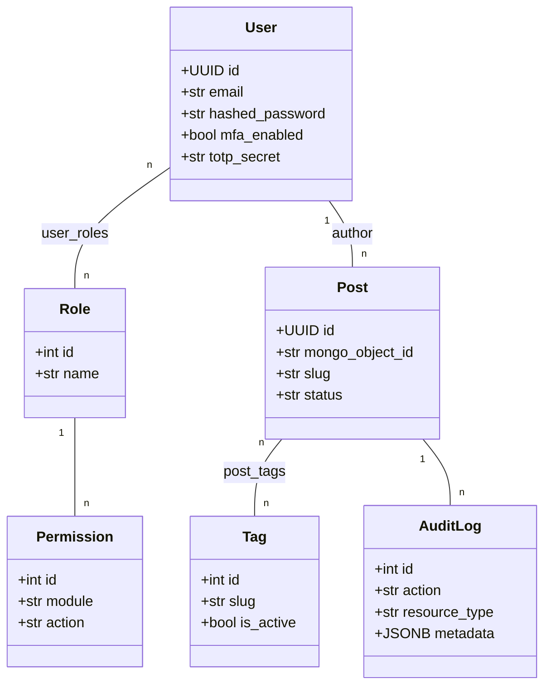

# [2] PostgreSQL: modelos, repositórios e migrations (Alembic)

> **Status:** ✅ Implementado

## Objetivo

Configurar a camada PostgreSQL com SQLAlchemy AsyncIO, criar todos os modelos ORM, repositórios e migrations via Alembic.

## Tarefas

- [x] Implementar `infrastructure/postgres/database.py` com engine assíncrono e `get_session`.
- [x] Criar modelos ORM em `infrastructure/postgres/models.py`: `users`, `roles`, `user_roles`, `permissions`, `tags`, `posts`, `post_tags`, `audit_logs`.
- [x] Criar repositórios em `infrastructure/postgres/repositories/`: `users.py`, `posts.py`, `tags.py`, `roles.py`.
- [x] Configurar Alembic (`alembic.ini`, `env.py`) para migrations assíncronas.
- [x] Criar migration inicial com todas as tabelas e índices definidos no SDD (seção 7).
- [x] Criar seed de papéis (`Master`, `Editor`, `Externo`) e permissões padrão (seção 9).

## Diagrama de Entidades

## Critérios de Aceite

- `alembic upgrade head` cria todas as tabelas sem erros.
- Índices em `posts.slug`, `posts.mongo_object_id`, `posts.status`, `posts.published_at` existem.
- Seed popula papéis e permissões padrão.
- Repositórios implementam as portas definidas em `application/*/ports.py`.