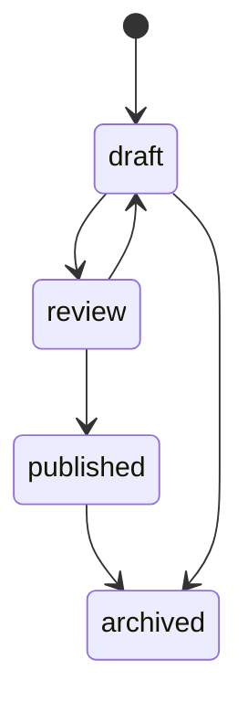

# [5] Domínio e casos de uso: Posts (CRUD, publicação e arquivamento)

> **Status:** ✅ Implementado

## Objetivo

Implementar a camada de domínio e casos de uso para Posts, com persistência dual (PostgreSQL + MongoDB) e estratégia de compensação.

## Tarefas

- [x] Criar entidade `Post` em `domain/posts/entities.py` com regras do SDD (seção 8).
- [x] Criar exceções de domínio em `domain/posts/exceptions.py`.
- [x] Implementar casos de uso em `application/posts/use_cases.py`: criar, atualizar, publicar, arquivar, excluir, listar, buscar por id/slug.
- [x] Implementar estratégia de compensação para falhas entre PostgreSQL e MongoDB (seção 10).
- [x] Implementar schemas Pydantic em `application/posts/schemas.py`.
- [x] Implementar router em `presentation/http/routers/posts.py` com todos os endpoints (seção 12).

## Fluxo de Publicação

## Critérios de Aceite

- `POST /api/v1/posts` cria post com HTML no MongoDB e referência no PostgreSQL.
- `POST /api/v1/posts/{id}/publish` falha se MongoDB não tiver HTML válido.
- Falha no PostgreSQL após criação MongoDB aciona compensação (remoção ou marcação como órfão).
- Listagem consulta apenas PostgreSQL (sem carregar HTML).
- Testes de integração cobrem criação, atualização e publicação.