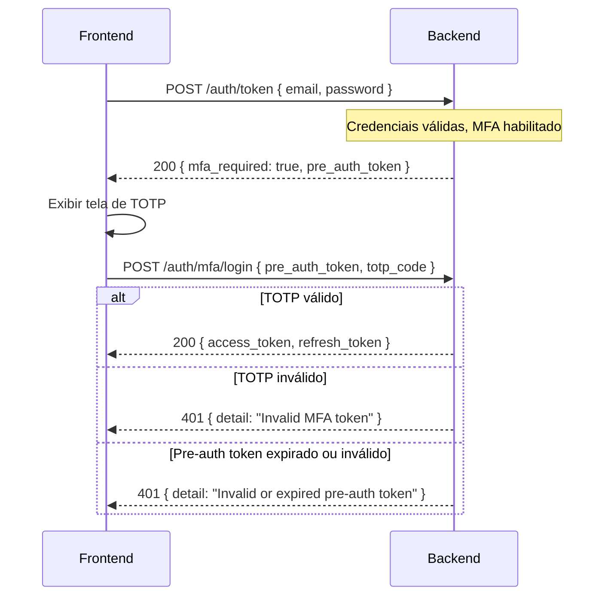

# [Backend] Fluxo MFA Login com Pre-Auth Token

## Objetivo

Implementar o handshake de MFA no login: quando um usuário com MFA habilitado faz login com credenciais válidas, o backend emite um **pre-auth token** de vida curta (5 minutos) em vez de rejeitar com 403. O frontend usa esse token para completar a verificação TOTP em um novo endpoint dedicado `POST /auth/mfa/login`.

Referência de design: spec:94772f59-b09f-4841-b5c0-dc363baa319c/6d307eff-82f5-4695-a711-db31eaa4ea7e (Gap 3 — Opção A).

## Contexto do Código Atual

- file:backend/app/application/auth/use_cases.py — método `login` lança `PermissionDeniedError("auth", "mfa_required")` quando `user.mfa_enabled` é `True`. Isso resulta em HTTP 403 sem nenhum token.
- file:backend/app/core/security.py — `create_token(sub, email, roles, expires_delta)` já aceita `expires_delta` customizado. Basta criar um token com claim `type: "pre_auth"` e TTL de 5 minutos.
- file:backend/app/presentation/http/routers/auth.py — `POST /auth/mfa/verify` exige `get_current_user` (access token válido). Esse endpoint **não deve ser alterado** — ele continua servindo o setup de MFA para usuários já autenticados. O novo endpoint de login MFA é separado.
- file:backend/app/presentation/http/dependencies.py — `get_current_user` decodifica qualquer JWT válido. Será necessária uma dependência análoga `get_pre_auth_user` que valida o claim `type: "pre_auth"` e rejeita tokens de acesso normais.
- file:backend/app/core/exceptions.py — `ForbiddenError` e `UnauthorizedError` são genéricos. Nenhuma mudança necessária aqui.

## Fluxo Completo

## Mudanças Necessárias

### 1. file:backend/app/application/auth/schemas.py

Adicionar dois novos schemas:

- **`MfaLoginRequired`**: resposta de login quando MFA é necessário.
  - Campos: `mfa_required: bool = True`, `pre_auth_token: str`
- **`MfaLoginRequest`**: payload do novo endpoint `POST /auth/mfa/login`.
  - Campos: `pre_auth_token: str`, `totp_code: str = Field(min_length=6, max_length=6)`

O schema `TokenOut` existente deve ganhar o campo opcional `refresh_token: str | None = None` (necessário também para o Gap 3 de refresh token).

### 2. file:backend/app/core/security.py

Adicionar função `create_pre_auth_token(sub: str) -> str`:

- Gera JWT com payload mínimo: `sub`, `type: "pre_auth"`, `iat`, `exp` (5 minutos).
- **Não inclui** `email`, `roles` nem qualquer claim de autorização.

Adicionar função `decode_pre_auth_token(token: str) -> dict`:

- Decodifica o JWT e valida que `payload["type"] == "pre_auth"`.
- Lança `UnauthorizedError` se o claim `type` estiver ausente ou for diferente de `"pre_auth"`.

### 3. file:backend/app/application/auth/use_cases.py

**Alterar ****`login`****:**

- Quando `user.mfa_enabled is True`, em vez de lançar `PermissionDeniedError`, chamar `create_pre_auth_token(sub=str(user.id))` e retornar `MfaLoginRequired(pre_auth_token=token)`.
- O tipo de retorno do método passa a ser `TokenOut | MfaLoginRequired`.

**Adicionar ****`mfa_login(pre_auth_token: str, totp_code: str) -> TokenOut`****:**

1. Chamar `decode_pre_auth_token(pre_auth_token)` — lança `UnauthorizedError` se inválido/expirado.
2. Extrair `sub` do payload e buscar o usuário via `user_repo.get_by_id`.
3. Validar que o usuário existe, está ativo e tem `mfa_enabled = True` e `totp_secret` definido.
4. Chamar `verify_totp(user.totp_secret, totp_code)` — lança `InvalidMFATokenError` se inválido.
5. Gerar e retornar `TokenOut` com `access_token` (e `refresh_token` quando implementado).

### 4. file:backend/app/presentation/http/dependencies.py

Adicionar dependência `get_pre_auth_user(authorization: str = Header(...)) -> dict`:

- Extrai o Bearer token do header.
- Chama `decode_pre_auth_token` — rejeita tokens de acesso normais (sem claim `type: "pre_auth"`).
- Retorna o payload decodificado (não busca o usuário no banco — isso é responsabilidade do use case).

### 5. file:backend/app/presentation/http/routers/auth.py

**Alterar ****`POST /auth/token`****:**

- Tipo de retorno passa a ser `TokenOut | MfaLoginRequired`.
- Nenhuma mudança na lógica — o use case já trata os dois casos.

**Adicionar ****`POST /auth/mfa/login`****:**

- Recebe `MfaLoginRequest` no body.
- Chama `use_cases.mfa_login(data.pre_auth_token, data.totp_code)`.
- Retorna `TokenOut`.
- **Não usa** `get_current_user` nem `get_pre_auth_user` como dependência — o pre-auth token vem no body, não no header Authorization.

## Segurança

| Risco | Mitigação |
| --- | --- |
| Pre-auth token reutilizado após TOTP válido | TTL de 5 minutos limita a janela; implementação futura pode adicionar revogação via Redis |
| Pre-auth token usado em endpoints protegidos | `get_current_user` não valida `type: "pre_auth"` — rejeita com 401 |
| Brute force no TOTP | Rate limit existente do `slowapi` deve ser aplicado em `POST /auth/mfa/login` (5/minute por IP) |
| Enumeração de usuários via pre-auth token | O endpoint retorna 401 genérico para TOTP inválido, expirado ou usuário não encontrado |

## Critérios de Aceite

POST /auth/token com usuário sem MFA retorna { access_token, token_type } (comportamento atual preservado).POST /auth/token com usuário com MFA habilitado retorna HTTP 200 com { mfa_required: true, pre_auth_token }.POST /auth/mfa/login com pre-auth token válido e TOTP correto retorna { access_token, token_type }.POST /auth/mfa/login com TOTP incorreto retorna HTTP 401.POST /auth/mfa/login com pre-auth token expirado (> 5 min) retorna HTTP 401.Pre-auth token rejeitado por get_current_user em qualquer rota protegida (retorna 401).POST /auth/mfa/verify (setup de MFA para usuário autenticado) continua funcionando sem alterações.Rate limit de 5/minute aplicado em POST /auth/mfa/login.