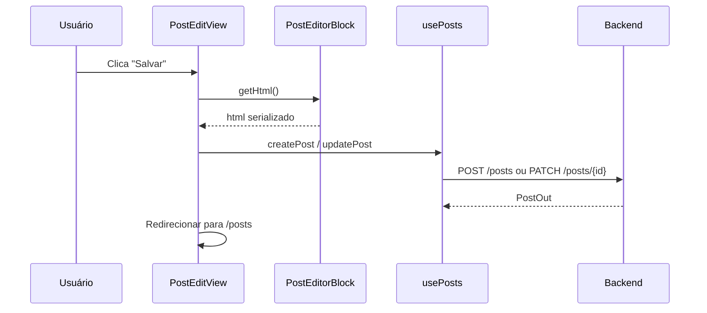

# [Frontend] Gestão de Posts — Listagem, Ações e Editor EditorJS

## Objetivo

Implementar a listagem de posts com filtros e ações editoriais, e o formulário de criação/edição com editor de conteúdo EditorJS 2.31 integrado ao backend. Estilização com Tailwind v4.

Referência: spec:94772f59-b09f-4841-b5c0-dc363baa319c/3c3f681f-1215-40e8-8933-498fcb3f308b.

## Dependências EditorJS

Instalar junto com este ticket:

| Pacote | Finalidade |
| --- | --- |
| `@editorjs/editorjs@2.31.x` | Core do editor |
| `@editorjs/header` | Bloco H1–H4 |
| `@editorjs/list` | Bloco de lista |
| `@editorjs/image` | Bloco de imagem (com uploader) |
| `@editorjs/quote` | Bloco de citação |
| `@editorjs/code` | Bloco de código |
| `@editorjs/delimiter` | Separador |
| `file-type` | Validação de MIME antes do upload |

## Componentes

### `PostsView.vue` (rota `/posts`)

Compõe `PostFilters` e `PostTable`. Delega para `usePosts`.

### `PostFilters.vue`

Botões de filtro por status: Todos | Rascunho | Revisão | Publicado | Arquivado.
Emite `filter(status: string | null)`. Botão ativo com estilo `bg-slate-900 text-white`.

### `PostTable.vue`

Props: `posts: PostOut[]`, `loading: boolean`
Emits: `edit`, `publish`, `archive`, `delete`

Colunas: Título, Slug, Status (badge colorido por status), Tags, Criado em, Ações.

Badges por status:

| Status | Classes Tailwind |
| --- | --- |
| `draft` | `bg-yellow-100 text-yellow-800` |
| `review` | `bg-blue-100 text-blue-800` |
| `published` | `bg-green-100 text-green-800` |
| `archived` | `bg-slate-100 text-slate-600` |

### `PostEditView.vue` (rotas `/posts/new` e `/posts/:id/edit`)

Layout de duas colunas: coluna principal com `PostForm` + `PostEditorBlock`, coluna lateral com status, tags e `PostImageUpload`.

### `PostForm.vue`

Campos: Título, Slug (auto-gerado, editável), Resumo, Tags (multi-select com tags ativas do backend).

### `PostEditorBlock.vue`

Wrapper do EditorJS. Inicializa com `html` existente convertido para blocos. Expõe `getHtml(): Promise<string>` para o pai serializar antes de salvar.

O `ImageTool` deve ser configurado com `uploader.uploadByFile`:

1. Validar MIME com `file-type` antes de enviar.
2. Chamar `POST /api/v1/posts/{post_id}/images` (multipart).
3. Mapear resposta `{ image_id, object_key, url }` para `{ success: 1, file: { url } }`.

### `PostImageUpload.vue`

Área de upload de imagem de capa com preview. Props: `postId`, `images`. Emits: `uploaded`, `removed`.

## Composables

### `usePosts` (file:frontend/src/modules/content-management/composables/usePosts.ts)

Métodos: `fetchPosts(page, status?)`, `fetchPostDetail(id)`, `createPost(data)`, `updatePost(id, data)`, `publishPost(id)`, `archivePost(id)`, `deletePost(id)`.

<user_quoted_section>⚠️ fetchPostDetail depende do endpoint GET /posts/{id}/detail (Gap 2 do backend). Enquanto não disponível, o editor inicia vazio ao editar posts existentes.</user_quoted_section>

### `usePostEditor` (file:frontend/src/modules/content-management/composables/usePostEditor.ts)

Gerencia ciclo de vida da instância EditorJS: inicialização com blocos, serialização para HTML e configuração do uploader de imagem.

### `usePostImages` (file:frontend/src/modules/content-management/composables/usePostImages.ts)

Métodos: `uploadImage(postId, file)`, `deleteImage(postId, imageId)`.

## Fluxo de Salvar Post

## Critérios de Aceite

Listagem de posts carrega com paginação.Filtro por status recarrega a lista com o parâmetro correto.Criar post com título, slug, resumo, tags e conteúdo EditorJS funciona end-to-end.EditorJS renderiza blocos de parágrafo, cabeçalho, lista, imagem, citação, código e delimitador.Upload de imagem via bloco EditorJS envia para o backend e renderiza a imagem no editor.Publicar post chama POST /posts/{id}/publish e atualiza o badge de status na listagem.Arquivar post chama POST /posts/{id}/archive e atualiza o badge.Excluir post exibe confirmação antes de chamar a API.Arquivo com MIME inválido é rejeitado pelo file-type antes de enviar ao backend.Nenhum estilo inline — apenas classes Tailwind v4.