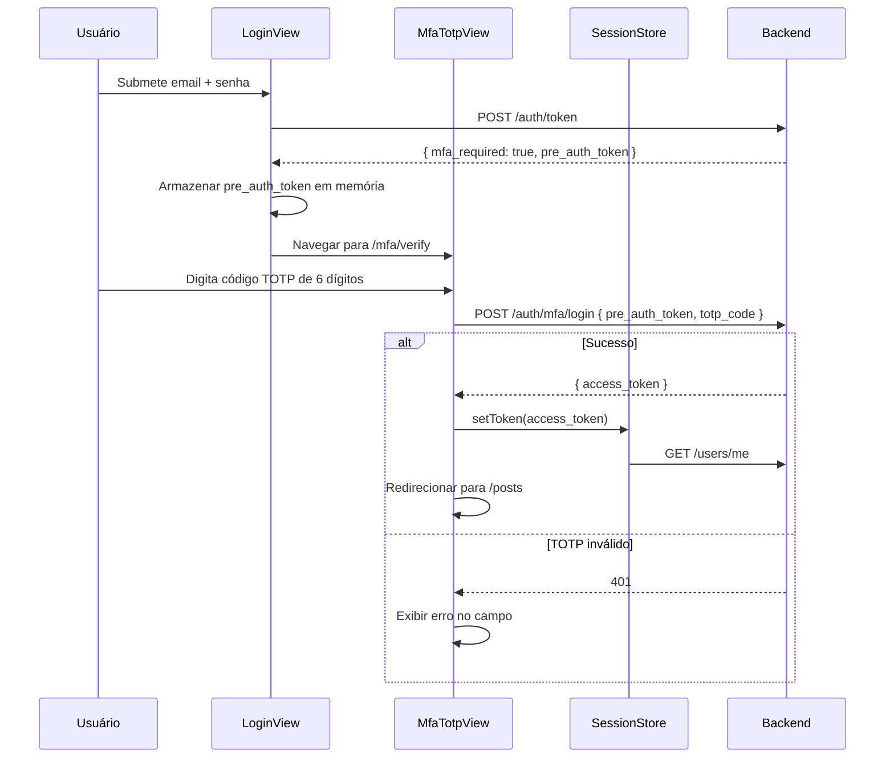

# [Frontend] Tela de TOTP no Fluxo de Login MFA

## Objetivo

Adaptar o fluxo de login do admin Vue 3 para tratar a resposta `{ mfa_required: true, pre_auth_token }` do backend, exibir a tela de verificação TOTP e completar a autenticação via `POST /auth/mfa/login`.

Depende de: ticket de backend acima estar implementado.
Referência: spec:94772f59-b09f-4841-b5c0-dc363baa319c/a765621d-61a0-41e7-96e1-4c6a0eb01efd ([3] Auth & Session).

## Fluxo de Telas



## Componentes e Composables

### Nova rota `/mfa/verify`

Adicionar ao router (file:frontend/src/router/index.ts):

- Path: `/mfa/verify`
- Componente: `MfaTotpView`
- Guard: público (o usuário ainda não está autenticado)
- A rota deve ser inacessível se não houver `pre_auth_token` em estado transitório — redirecionar para `/login`.

### `MfaTotpView.vue`

Tela simples com campo de 6 dígitos para o código TOTP. Exibe erro quando o backend rejeita. Botão "Voltar" limpa o estado e retorna para `/login`.

### Alteração em `useLogin` (file:frontend/src/modules/auth-session/composables/useLogin.ts)

Após `POST /auth/token`:

- Se a resposta contiver `mfa_required: true`, armazenar `pre_auth_token` em estado reativo transitório (não em `sessionStorage`) e navegar para `/mfa/verify`.
- Se a resposta contiver `access_token`, seguir o fluxo normal de sessão.

### Novo composable `useMfaLogin` (file:frontend/src/modules/auth-session/composables/useMfaLogin.ts)

Expõe:

- `totpCode: Ref<string>` — campo de 6 dígitos
- `isLoading: Ref<boolean>`
- `error: Ref<string | null>`
- `submit(): Promise<void>` — chama `POST /auth/mfa/login`, trata sucesso e erro

### Atualização em `api/auth.ts`

Adicionar função `mfaLogin(preAuthToken: string, totpCode: string): Promise<TokenOut>` que chama `POST /auth/mfa/login`.

### Atualização nos tipos (file:frontend/src/types/auth.ts)

Adicionar:

- `interface MfaLoginRequired { mfa_required: true; pre_auth_token: string }`
- `type LoginResponse = TokenOut | MfaLoginRequired`
- `interface MfaLoginRequest { pre_auth_token: string; totp_code: string }`

## Tela de Verificação TOTP

```wireframe

<html>
<head>
<style>
* { box-sizing: border-box; margin: 0; padding: 0; font-family: sans-serif; }
body { background: #f1f5f9; display: flex; align-items: center; justify-content: center; min-height: 100vh; }
.card { background: #fff; border-radius: 12px; padding: 40px; width: 380px; box-shadow: 0 4px 24px rgba(0,0,0,0.08); }
.icon { text-align: center; font-size: 36px; margin-bottom: 12px; }
.title { text-align: center; font-size: 20px; font-weight: bold; color: #1e293b; margin-bottom: 8px; }
.subtitle { text-align: center; font-size: 14px; color: #64748b; margin-bottom: 28px; line-height: 1.5; }
.field { margin-bottom: 20px; }
label { display: block; font-size: 13px; font-weight: 500; color: #374151; margin-bottom: 6px; }
.totp-input { width: 100%; padding: 14px 12px; border: 1px solid #d1d5db; border-radius: 6px; font-size: 24px; font-weight: bold; text-align: center; letter-spacing: 0.4em; color: #111827; }
.totp-input:focus { outline: none; border-color: #3b82f6; }
.btn { width: 100%; padding: 11px; background: #3b82f6; color: #fff; border: none; border-radius: 6px; font-size: 15px; font-weight: 500; cursor: pointer; margin-bottom: 12px; }
.btn-back { width: 100%; padding: 10px; background: transparent; color: #64748b; border: 1px solid #d1d5db; border-radius: 6px; font-size: 14px; cursor: pointer; }
.error { background: #fef2f2; border: 1px solid #fca5a5; border-radius: 6px; padding: 10px 14px; font-size: 13px; color: #b91c1c; margin-bottom: 16px; }
.hint { font-size: 12px; color: #94a3b8; text-align: center; margin-top: 16px; }
</style>
</head>
<body>
<div class="card">
  <div class="icon">🔐</div>
  <div class="title">Verificação em dois fatores</div>
  <div class="subtitle">Abra seu aplicativo autenticador e insira o código de 6 dígitos.</div>
  <div class="error">Código inválido. Verifique seu aplicativo e tente novamente.</div>
  <div class="field">
    <label>Código TOTP</label>
    <input class="totp-input" type="text" maxlength="6" placeholder="000000" />
  </div>
  <button class="btn">Verificar</button>
  <button class="btn-back">← Voltar para o login</button>
  <div class="hint">O código expira a cada 30 segundos.</div>
</div>
</body>
</html>
```

## Critérios de Aceite

Login com usuário sem MFA segue o fluxo atual sem alterações.Login com usuário com MFA habilitado exibe a tela de TOTP em vez de redirecionar para /mfa-blocked.Código TOTP correto completa a autenticação e redireciona para /posts.Código TOTP incorreto exibe mensagem de erro sem limpar o campo.Botão "Voltar" limpa o pre_auth_token da memória e retorna para /login.Acesso direto a /mfa/verify sem pre_auth_token redireciona para /login.pre_auth_token nunca é persistido em sessionStorage ou localStorage.A tela MfaBlockedView existente pode ser removida ou mantida como fallback para erros inesperados.