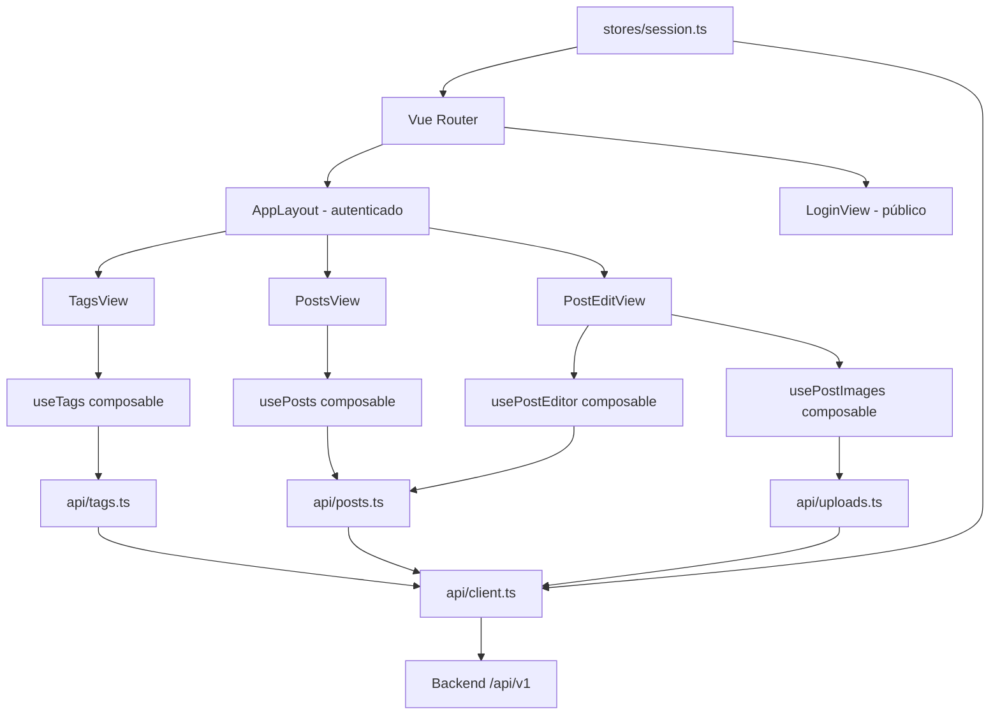
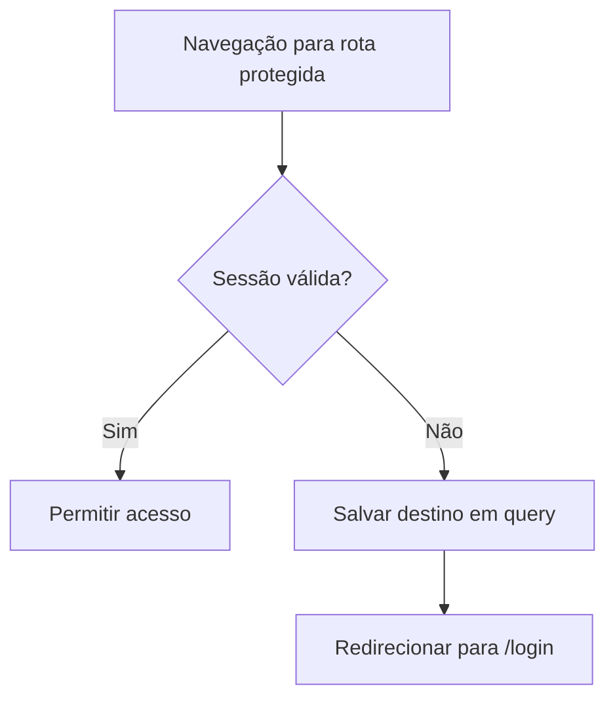
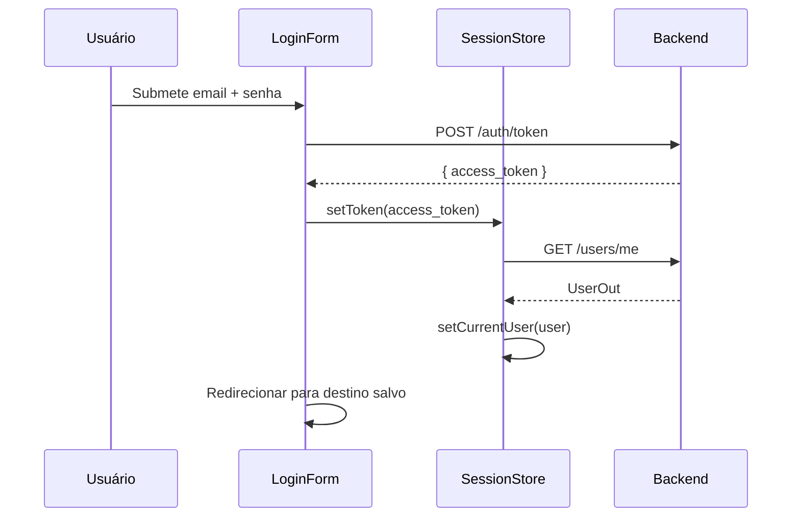

# SDD — Frontend CMS Admin (Vue 3 + EditorJS)

# SDD — Frontend CMS Admin (Vue 3 + EditorJS)

<user_quoted_section>Pasta alvo: frontend/Status: 🔲 A implementarVersão do backend consumido: v0.1.0 — prefixo /api/v1</user_quoted_section>

## 1. Objetivo

Criar o painel administrativo do CMS como uma SPA Vue 3 que consome a API REST do backend FastAPI. O admin deve cobrir autenticação, gestão de tags, gestão de posts (com editor de conteúdo EditorJS 2.31) e upload de imagens.

## 2. Stack Técnica

| Categoria | Tecnologia |
| --- | --- |
| Framework | Vue 3.5 + Composition API (`<script setup lang="ts">`) |
| Build | Vite |
| Roteamento | vue-router 4 |
| Estado global | Pinia |
| HTTP | axios (ou fetch nativo com wrapper) |
| Editor de conteúdo | EditorJS 2.31 |
| Estilização | Tailwind CSS v4 (via `@tailwindcss/vite`) |
| Validação de arquivo | `file-type` |
| Linguagem | TypeScript |
| Testes | Vitest + Vue Test Utils |
| Lint | ESLint + Prettier |

## 3. Estrutura de Pastas

```
frontend/
  src/
    main.ts                    # Bootstrap da aplicação
    App.vue                    # Root component
    router/
      index.ts                 # Definição de rotas e guards
    stores/
      session.ts               # Pinia store — sessão autenticada
    api/
      client.ts                # Instância axios com interceptors
      auth.ts                  # Chamadas de auth
      tags.ts                  # Chamadas de tags
      posts.ts                 # Chamadas de posts
      uploads.ts               # Chamadas de upload/imagem
    types/
      auth.ts
      post.ts
      tag.ts
    modules/
      app-shell/
        components/
          AppLayout.vue        # Layout autenticado (sidebar + header)
          AppSidebar.vue
          AppHeader.vue
        composables/
          useNavigation.ts
      auth-session/
        views/
          LoginView.vue
          MfaBlockedView.vue
        components/
          LoginForm.vue
          MfaSetupModal.vue
        composables/
          useLogin.ts
          useSession.ts
      content-management/
        views/
          TagsView.vue
          PostsView.vue
          PostEditView.vue
        components/
          tags/
            TagTable.vue
            TagFormModal.vue
          posts/
            PostTable.vue
            PostFilters.vue
            PostForm.vue
            PostEditorBlock.vue  # Wrapper EditorJS
            PostImageUpload.vue
        composables/
          useTags.ts
          usePosts.ts
          usePostEditor.ts
          usePostImages.ts
    shared/
      components/
        BaseButton.vue
        BaseInput.vue
        BaseModal.vue
        BasePagination.vue
        LoadingSpinner.vue
        EmptyState.vue
        ApiErrorAlert.vue
      composables/
        useApiError.ts
        usePagination.ts
  public/
  index.html
  vite.config.ts
  tsconfig.json
  .env.example
```

## 4. Arquitetura Geral



## 5. Módulo: App Shell

### 5.1 Responsabilidades

- Inicializar o router com guards de autenticação.
- Renderizar o layout autenticado (sidebar + header) para rotas protegidas.
- Redirecionar usuários não autenticados para `/login`.
- Preservar a rota de destino para redirecionamento pós-login.

### 5.2 Rotas

| Path | Componente | Guard |
| --- | --- | --- |
| `/login` | `LoginView` | público |
| `/` | redirect → `/posts` | autenticado |
| `/posts` | `PostsView` | autenticado |
| `/posts/new` | `PostEditView` | autenticado |
| `/posts/:id/edit` | `PostEditView` | autenticado |
| `/tags` | `TagsView` | autenticado |
| `/mfa-blocked` | `MfaBlockedView` | público |

### 5.3 Guard de Rota



### 5.4 Layout Autenticado

```wireframe

<html>
<head>
<style>
* { box-sizing: border-box; margin: 0; padding: 0; font-family: sans-serif; }
body { display: flex; height: 100vh; background: #f5f5f5; }
.sidebar { width: 220px; background: #1e293b; color: #fff; display: flex; flex-direction: column; padding: 16px 0; }
.sidebar-logo { padding: 12px 20px 24px; font-size: 18px; font-weight: bold; border-bottom: 1px solid #334155; }
.sidebar-nav { flex: 1; padding: 16px 0; }
.nav-item { display: block; padding: 10px 20px; color: #94a3b8; text-decoration: none; font-size: 14px; }
.nav-item.active { background: #334155; color: #fff; border-left: 3px solid #3b82f6; }
.sidebar-footer { padding: 16px 20px; border-top: 1px solid #334155; font-size: 13px; color: #64748b; }
.main { flex: 1; display: flex; flex-direction: column; overflow: hidden; }
.header { background: #fff; border-bottom: 1px solid #e2e8f0; padding: 0 24px; height: 56px; display: flex; align-items: center; justify-content: space-between; }
.header-title { font-size: 16px; font-weight: 600; color: #1e293b; }
.header-user { display: flex; align-items: center; gap: 8px; font-size: 14px; color: #475569; }
.avatar { width: 32px; height: 32px; border-radius: 50%; background: #3b82f6; color: #fff; display: flex; align-items: center; justify-content: center; font-size: 13px; font-weight: bold; }
.content { flex: 1; overflow-y: auto; padding: 24px; }
.page-placeholder { background: #fff; border: 1px solid #e2e8f0; border-radius: 8px; padding: 32px; color: #94a3b8; text-align: center; }
</style>
</head>
<body>
<div class="sidebar">
  <div class="sidebar-logo">CMS Admin</div>
  <nav class="sidebar-nav">
    <a class="nav-item" href="#">Posts</a>
    <a class="nav-item active" href="#">Tags</a>
  </nav>
  <div class="sidebar-footer">admin@cms.local</div>
</div>
<div class="main">
  <header class="header">
    <span class="header-title">Tags</span>
    <div class="header-user">
      <div class="avatar">A</div>
      <span>Admin</span>
    </div>
  </header>
  <div class="content">
    <div class="page-placeholder">Conteúdo da página aqui</div>
  </div>
</div>
</body>
</html>
```

## 6. Módulo: Auth & Session

### 6.1 Responsabilidades

- Tela de login com email e senha.
- Persistência do `access_token` em `sessionStorage`.
- Hidratação do usuário atual via `GET /users/me`.
- Restauração de sessão no reload.
- Renovação via `POST /auth/refresh` quando `refresh_token` disponível.
- Tela bloqueada para `auth:mfa_required` sem challenge de pré-autenticação.
- Modal de setup de MFA para administradores autenticados.

### 6.2 Contratos de API Consumidos

| Endpoint | Payload | Resposta |
| --- | --- | --- |
| `POST /auth/token` | `{ email, password }` | `{ access_token, token_type }` |
| `POST /auth/refresh` | `{ refresh_token }` | `{ access_token, token_type }` |
| `POST /auth/logout` | — | 204 |
| `GET /users/me` | — | `UserOut` |
| `POST /auth/mfa/setup` | — | `{ secret, qrcode }` |
| `POST /auth/mfa/verify` | `{ token }` | `{ access_token, token_type }` |

<user_quoted_section>⚠️ Gap de contrato: POST /auth/token atualmente retorna apenas access_token. O campo refresh_token não é emitido. Enquanto não for adicionado ao backend, a sessão não suporta renovação automática — o usuário será redirecionado para login ao expirar.</user_quoted_section>

### 6.3 Session Store (Pinia)

| Estado | Tipo | Descrição |
| --- | --- | --- |
| `accessToken` | `string \| null` | Token JWT atual |
| `refreshToken` | `string \| null` | Token de renovação (quando disponível) |
| `currentUser` | `UserOut \| null` | Perfil do usuário autenticado |
| `isAuthenticated` | `computed` | `accessToken !== null` |

### 6.4 Fluxo de Login



### 6.5 Tela de Login

```wireframe

<html>
<head>
<style>
* { box-sizing: border-box; margin: 0; padding: 0; font-family: sans-serif; }
body { background: #f1f5f9; display: flex; align-items: center; justify-content: center; min-height: 100vh; }
.card { background: #fff; border-radius: 12px; padding: 40px; width: 380px; box-shadow: 0 4px 24px rgba(0,0,0,0.08); }
.logo { text-align: center; font-size: 22px; font-weight: bold; color: #1e293b; margin-bottom: 8px; }
.subtitle { text-align: center; font-size: 14px; color: #64748b; margin-bottom: 32px; }
.field { margin-bottom: 20px; }
label { display: block; font-size: 13px; font-weight: 500; color: #374151; margin-bottom: 6px; }
input { width: 100%; padding: 10px 12px; border: 1px solid #d1d5db; border-radius: 6px; font-size: 14px; color: #111827; }
input:focus { outline: none; border-color: #3b82f6; }
.btn { width: 100%; padding: 11px; background: #3b82f6; color: #fff; border: none; border-radius: 6px; font-size: 15px; font-weight: 500; cursor: pointer; }
.error { background: #fef2f2; border: 1px solid #fca5a5; border-radius: 6px; padding: 10px 14px; font-size: 13px; color: #b91c1c; margin-bottom: 16px; }
</style>
</head>
<body>
<div class="card">
  <div class="logo">CMS Admin</div>
  <div class="subtitle">Acesse o painel administrativo</div>
  <div class="error">Credenciais inválidas. Tente novamente.</div>
  <div class="field">
    <label>E-mail</label>
    <input type="email" placeholder="admin@cms.local" />
  </div>
  <div class="field">
    <label>Senha</label>
    <input type="password" placeholder="••••••••" />
  </div>
  <button class="btn">Entrar</button>
</div>
</body>
</html>
```

## 7. Módulo: Content Management

### 7.1 Tags

#### Responsabilidades

- Listar tags com paginação (`GET /tags?page=&page_size=`).
- Criar tag via modal (`POST /tags`).
- Editar tag via modal (`PATCH /tags/{id}`).
- Excluir tag com confirmação (`DELETE /tags/{id}`).
- Exibir erros de validação e conflito (slug duplicado).

#### Contratos de API

| Endpoint | Payload | Resposta |
| --- | --- | --- |
| `GET /tags` | `page`, `page_size` | `PaginatedResult<TagOut>` |
| `POST /tags` | `{ name, slug, description? }` | `TagOut` |
| `PATCH /tags/{id}` | `{ name?, description? }` | `TagOut` |
| `DELETE /tags/{id}` | — | 204 |

#### Tela de Tags

```wireframe

<html>
<head>
<style>
* { box-sizing: border-box; margin: 0; padding: 0; font-family: sans-serif; }
body { background: #f5f5f5; padding: 24px; }
.page-header { display: flex; justify-content: space-between; align-items: center; margin-bottom: 20px; }
h1 { font-size: 20px; font-weight: 600; color: #1e293b; }
.btn-primary { background: #3b82f6; color: #fff; border: none; padding: 9px 18px; border-radius: 6px; font-size: 14px; cursor: pointer; }
.card { background: #fff; border-radius: 8px; border: 1px solid #e2e8f0; overflow: hidden; }
table { width: 100%; border-collapse: collapse; }
th { background: #f8fafc; padding: 12px 16px; text-align: left; font-size: 12px; font-weight: 600; color: #64748b; text-transform: uppercase; letter-spacing: 0.05em; border-bottom: 1px solid #e2e8f0; }
td { padding: 12px 16px; font-size: 14px; color: #374151; border-bottom: 1px solid #f1f5f9; }
.badge { display: inline-block; padding: 2px 8px; border-radius: 9999px; font-size: 12px; font-weight: 500; }
.badge-active { background: #dcfce7; color: #166534; }
.badge-inactive { background: #f1f5f9; color: #64748b; }
.actions { display: flex; gap: 8px; }
.btn-sm { padding: 5px 10px; border-radius: 4px; font-size: 12px; cursor: pointer; border: 1px solid #d1d5db; background: #fff; color: #374151; }
.btn-danger { border-color: #fca5a5; color: #dc2626; }
.pagination { display: flex; justify-content: flex-end; align-items: center; gap: 8px; padding: 12px 16px; border-top: 1px solid #e2e8f0; font-size: 13px; color: #64748b; }
.page-btn { padding: 4px 10px; border: 1px solid #d1d5db; border-radius: 4px; background: #fff; cursor: pointer; font-size: 13px; }
</style>
</head>
<body>
<div class="page-header">
  <h1>Tags</h1>
  <button class="btn-primary">+ Nova Tag</button>
</div>
<div class="card">
  <table>
    <thead>
      <tr>
        <th>Nome</th>
        <th>Slug</th>
        <th>Descrição</th>
        <th>Status</th>
        <th>Ações</th>
      </tr>
    </thead>
    <tbody>
      <tr>
        <td>Educação</td>
        <td>educacao</td>
        <td>Conteúdo educacional</td>
        <td><span class="badge badge-active">Ativa</span></td>
        <td><div class="actions"><button class="btn-sm">Editar</button><button class="btn-sm btn-danger">Excluir</button></div></td>
      </tr>
      <tr>
        <td>Notícias</td>
        <td>noticias</td>
        <td>—</td>
        <td><span class="badge badge-active">Ativa</span></td>
        <td><div class="actions"><button class="btn-sm">Editar</button><button class="btn-sm btn-danger">Excluir</button></div></td>
      </tr>
      <tr>
        <td>Arquivo</td>
        <td>arquivo</td>
        <td>Conteúdo arquivado</td>
        <td><span class="badge badge-inactive">Inativa</span></td>
        <td><div class="actions"><button class="btn-sm">Editar</button><button class="btn-sm btn-danger">Excluir</button></div></td>
      </tr>
    </tbody>
  </table>
  <div class="pagination">
    <span>1–3 de 3</span>
    <button class="page-btn">‹</button>
    <button class="page-btn">›</button>
  </div>
</div>
</body>
</html>
```

### 7.2 Posts

#### Responsabilidades

- Listar posts com filtro por status e paginação.
- Ações de linha: editar, publicar, arquivar, excluir.
- Criar e editar post com campos: título, slug, resumo, tags, conteúdo (EditorJS), imagens.
- Carregar conteúdo editável (`html`, `summary`, `images`) ao abrir edição.

#### Contratos de API

| Endpoint | Payload | Resposta |
| --- | --- | --- |
| `GET /posts` | `page`, `page_size`, `status?` | `PaginatedResult<PostOut>` |
| `POST /posts` | `PostCreate` | `PostOut` |
| `GET /posts/{id}` | — | `PostOut` (sem `html`) |
| `PATCH /posts/{id}` | `PostUpdate` | `PostOut` |
| `POST /posts/{id}/publish` | — | `PostOut` |
| `POST /posts/{id}/archive` | — | `PostOut` |
| `DELETE /posts/{id}` | — | 204 |

<user_quoted_section>⚠️ Gap de contrato: GET /posts/{id} retorna PostOut sem o campo html nem images. Para edição, o frontend precisará de PostDetailOut (já modelado no backend com content: PostContentOut). O endpoint deve ser expandido ou um endpoint dedicado /posts/{id}/detail deve ser criado.</user_quoted_section>

#### Schema `PostCreate` / `PostUpdate`

```
PostCreate: { title, slug, html, summary, tag_ids: int[] }
PostUpdate: { title?, html?, summary?, tag_ids? }
```

#### Tela de Listagem de Posts

```wireframe

<html>
<head>
<style>
* { box-sizing: border-box; margin: 0; padding: 0; font-family: sans-serif; }
body { background: #f5f5f5; padding: 24px; }
.page-header { display: flex; justify-content: space-between; align-items: center; margin-bottom: 16px; }
h1 { font-size: 20px; font-weight: 600; color: #1e293b; }
.btn-primary { background: #3b82f6; color: #fff; border: none; padding: 9px 18px; border-radius: 6px; font-size: 14px; cursor: pointer; }
.filters { display: flex; gap: 8px; margin-bottom: 16px; }
.filter-btn { padding: 6px 14px; border-radius: 9999px; border: 1px solid #d1d5db; background: #fff; font-size: 13px; cursor: pointer; color: #374151; }
.filter-btn.active { background: #1e293b; color: #fff; border-color: #1e293b; }
.card { background: #fff; border-radius: 8px; border: 1px solid #e2e8f0; overflow: hidden; }
table { width: 100%; border-collapse: collapse; }
th { background: #f8fafc; padding: 12px 16px; text-align: left; font-size: 12px; font-weight: 600; color: #64748b; text-transform: uppercase; border-bottom: 1px solid #e2e8f0; }
td { padding: 12px 16px; font-size: 14px; color: #374151; border-bottom: 1px solid #f1f5f9; vertical-align: middle; }
.badge { display: inline-block; padding: 2px 8px; border-radius: 9999px; font-size: 12px; font-weight: 500; }
.badge-draft { background: #fef9c3; color: #854d0e; }
.badge-published { background: #dcfce7; color: #166534; }
.badge-archived { background: #f1f5f9; color: #64748b; }
.actions { display: flex; gap: 6px; }
.btn-sm { padding: 5px 10px; border-radius: 4px; font-size: 12px; cursor: pointer; border: 1px solid #d1d5db; background: #fff; color: #374151; }
.btn-publish { border-color: #86efac; color: #16a34a; }
.btn-archive { border-color: #fcd34d; color: #92400e; }
.btn-danger { border-color: #fca5a5; color: #dc2626; }
.pagination { display: flex; justify-content: flex-end; align-items: center; gap: 8px; padding: 12px 16px; border-top: 1px solid #e2e8f0; font-size: 13px; color: #64748b; }
.page-btn { padding: 4px 10px; border: 1px solid #d1d5db; border-radius: 4px; background: #fff; cursor: pointer; font-size: 13px; }
</style>
</head>
<body>
<div class="page-header">
  <h1>Posts</h1>
  <button class="btn-primary">+ Novo Post</button>
</div>
<div class="filters">
  <button class="filter-btn active">Todos</button>
  <button class="filter-btn">Rascunho</button>
  <button class="filter-btn">Publicado</button>
  <button class="filter-btn">Arquivado</button>
</div>
<div class="card">
  <table>
    <thead>
      <tr>
        <th>Título</th>
        <th>Slug</th>
        <th>Status</th>
        <th>Tags</th>
        <th>Criado em</th>
        <th>Ações</th>
      </tr>
    </thead>
    <tbody>
      <tr>
        <td>Introdução ao Vue 3</td>
        <td>introducao-vue-3</td>
        <td><span class="badge badge-draft">Rascunho</span></td>
        <td>Educação</td>
        <td>20/05/2026</td>
        <td><div class="actions"><button class="btn-sm">Editar</button><button class="btn-sm btn-publish">Publicar</button><button class="btn-sm btn-danger">Excluir</button></div></td>
      </tr>
      <tr>
        <td>FastAPI com Hexagonal</td>
        <td>fastapi-hexagonal</td>
        <td><span class="badge badge-published">Publicado</span></td>
        <td>Notícias</td>
        <td>18/05/2026</td>
        <td><div class="actions"><button class="btn-sm">Editar</button><button class="btn-sm btn-archive">Arquivar</button><button class="btn-sm btn-danger">Excluir</button></div></td>
      </tr>
    </tbody>
  </table>
  <div class="pagination">
    <span>1–2 de 2</span>
    <button class="page-btn">‹</button>
    <button class="page-btn">›</button>
  </div>
</div>
</body>
</html>
```

### 7.3 Editor de Post (EditorJS 2.31)

#### Responsabilidades

- Renderizar o editor EditorJS dentro do componente `PostEditorBlock.vue`.
- Inicializar com dados existentes (`html` convertido para blocos EditorJS) ao editar.
- Serializar os blocos EditorJS de volta para `html` ao salvar.
- Integrar upload de imagem diretamente no EditorJS via `ImageTool` apontando para `POST /posts/{id}/images`.

#### Blocos EditorJS Suportados

| Bloco | Plugin |
| --- | --- |
| Parágrafo | nativo |
| Cabeçalho (H1–H4) | `@editorjs/header` |
| Lista | `@editorjs/list` |
| Imagem | `@editorjs/image` |
| Citação | `@editorjs/quote` |
| Código | `@editorjs/code` |
| Delimitador | `@editorjs/delimiter` |

#### Integração de Upload de Imagem no EditorJS

O `ImageTool` deve ser configurado com `uploader.uploadByFile` apontando para `POST /api/v1/posts/{post_id}/images`. A resposta do backend (`{ image_id, object_key, url }`) deve ser mapeada para o formato esperado pelo EditorJS:

```
{ success: 1, file: { url: <url_do_download> } }
```

#### Tela de Edição de Post

```wireframe

<html>
<head>
<style>
* { box-sizing: border-box; margin: 0; padding: 0; font-family: sans-serif; }
body { background: #f5f5f5; padding: 24px; }
.page-header { display: flex; justify-content: space-between; align-items: center; margin-bottom: 20px; }
h1 { font-size: 20px; font-weight: 600; color: #1e293b; }
.header-actions { display: flex; gap: 8px; }
.btn { padding: 9px 18px; border-radius: 6px; font-size: 14px; cursor: pointer; border: 1px solid #d1d5db; background: #fff; color: #374151; }
.btn-primary { background: #3b82f6; color: #fff; border-color: #3b82f6; }
.btn-publish { background: #16a34a; color: #fff; border-color: #16a34a; }
.layout { display: grid; grid-template-columns: 1fr 280px; gap: 20px; }
.card { background: #fff; border-radius: 8px; border: 1px solid #e2e8f0; padding: 20px; }
.field { margin-bottom: 16px; }
label { display: block; font-size: 13px; font-weight: 500; color: #374151; margin-bottom: 6px; }
input, textarea, select { width: 100%; padding: 9px 12px; border: 1px solid #d1d5db; border-radius: 6px; font-size: 14px; color: #111827; }
textarea { resize: vertical; min-height: 72px; }
.editor-area { border: 1px solid #e2e8f0; border-radius: 6px; min-height: 320px; padding: 16px; background: #fafafa; }
.editor-placeholder { color: #94a3b8; font-size: 14px; }
.editor-block { padding: 8px 0; border-bottom: 1px dashed #e2e8f0; font-size: 14px; color: #374151; }
.editor-block:last-child { border-bottom: none; }
.editor-toolbar { display: flex; gap: 6px; margin-bottom: 12px; padding-bottom: 10px; border-bottom: 1px solid #e2e8f0; }
.tool-btn { padding: 4px 10px; border: 1px solid #d1d5db; border-radius: 4px; font-size: 12px; background: #fff; cursor: pointer; color: #374151; }
.sidebar-card { background: #fff; border-radius: 8px; border: 1px solid #e2e8f0; padding: 16px; margin-bottom: 16px; }
.sidebar-title { font-size: 13px; font-weight: 600; color: #374151; margin-bottom: 12px; }
.tag-list { display: flex; flex-wrap: wrap; gap: 6px; }
.tag-chip { padding: 3px 10px; background: #eff6ff; border: 1px solid #bfdbfe; border-radius: 9999px; font-size: 12px; color: #1d4ed8; }
.image-upload-area { border: 2px dashed #d1d5db; border-radius: 6px; padding: 20px; text-align: center; color: #94a3b8; font-size: 13px; cursor: pointer; }
.status-badge { display: inline-block; padding: 3px 10px; border-radius: 9999px; font-size: 12px; font-weight: 500; background: #fef9c3; color: #854d0e; }
</style>
</head>
<body>
<div class="page-header">
  <h1>Editar Post</h1>
  <div class="header-actions">
    <button class="btn">Salvar Rascunho</button>
    <button class="btn btn-publish">Publicar</button>
  </div>
</div>
<div class="layout">
  <div>
    <div class="card">
      <div class="field">
        <label>Título</label>
        <input type="text" value="Introdução ao Vue 3" />
      </div>
      <div class="field">
        <label>Slug</label>
        <input type="text" value="introducao-vue-3" />
      </div>
      <div class="field">
        <label>Resumo</label>
        <textarea>Um guia prático para começar com Vue 3 e Composition API.</textarea>
      </div>
      <div class="field">
        <label>Conteúdo (EditorJS)</label>
        <div class="editor-area">
          <div class="editor-toolbar">
            <button class="tool-btn">H</button>
            <button class="tool-btn">¶</button>
            <button class="tool-btn">≡</button>
            <button class="tool-btn">🖼</button>
            <button class="tool-btn">"</button>
            <button class="tool-btn"></></button>
          </div>
          <div class="editor-block"><strong>Introdução ao Vue 3</strong></div>
          <div class="editor-block">Vue 3 introduz a Composition API como forma principal de organizar lógica...</div>
          <div class="editor-block" style="color:#94a3b8;">Clique para adicionar um novo bloco...</div>
        </div>
      </div>
    </div>
  </div>
  <div>
    <div class="sidebar-card">
      <div class="sidebar-title">Status</div>
      <span class="status-badge">Rascunho</span>
    </div>
    <div class="sidebar-card">
      <div class="sidebar-title">Tags</div>
      <div class="tag-list">
        <span class="tag-chip">Educação</span>
        <span class="tag-chip">+ Adicionar</span>
      </div>
    </div>
    <div class="sidebar-card">
      <div class="sidebar-title">Imagem de Capa</div>
      <div class="image-upload-area">Clique ou arraste uma imagem<br/><small>JPEG, PNG, WebP — máx. 10MB</small></div>
    </div>
  </div>
</div>
</body>
</html>
```

## 8. Camada HTTP Compartilhada

### 8.1 Cliente Axios

- `baseURL` lida de `import.meta.env.VITE_API_BASE_URL`.
- Interceptor de request: injeta `Authorization: Bearer <token>` da session store.
- Interceptor de response: normaliza erros `401` (limpa sessão + redireciona para login), `403`, `409`, `422` e erros de rede.

### 8.2 Tratamento de Erros Normalizado

| Código HTTP | Comportamento |
| --- | --- |
| 401 | Limpar sessão → redirecionar para `/login` |
| 403 | Exibir `ApiErrorAlert` com mensagem de permissão |
| 409 | Exibir erro de conflito no formulário |
| 422 | Mapear erros de campo do Pydantic para o formulário |
| 5xx / rede | Exibir mensagem genérica de erro |

## 9. Gaps de Contrato Backend

| Gap | Impacto | Ação Necessária |
| --- | --- | --- |
| `POST /auth/token` não retorna `refresh_token` | Sem renovação automática de sessão | Backend deve emitir `refresh_token` ou frontend opera sem renovação |
| `GET /posts/{id}` não retorna `html` nem `images` | Editor não pode carregar conteúdo existente | Backend deve retornar `PostDetailOut` com `content: PostContentOut` |
| MFA login não expõe challenge de pré-autenticação | Fluxo MFA no login bloqueado | Backend deve definir handshake de MFA ou frontend exibe estado bloqueado |
| `image_id` retornado pelo upload é `safe_name` sem extensão | Identificador instável para delete/download | Backend deve padronizar e documentar o `image_id` estável |

## 10. Variáveis de Ambiente

| Variável | Exemplo | Descrição |
| --- | --- | --- |
| `VITE_API_BASE_URL` | `http://localhost:8000/api/v1` | URL base do backend |

## 11. Critérios de Aceite

App Vue 3 inicia com npm run dev e lê VITE_API_BASE_URL do .env.Usuário não autenticado é redirecionado para /login.Login com credenciais válidas persiste sessão e redireciona para /posts.Sessão é restaurada no reload via sessionStorage.CRUD de tags funciona com feedback de erro de validação.Listagem de posts filtra por status.Editor EditorJS carrega, permite edição e serializa para html ao salvar.Upload de imagem via EditorJS ImageTool funciona com o backend.Publicar e arquivar post atualiza o status na listagem.Erros de API são exibidos de forma consistente em toda a aplicação.