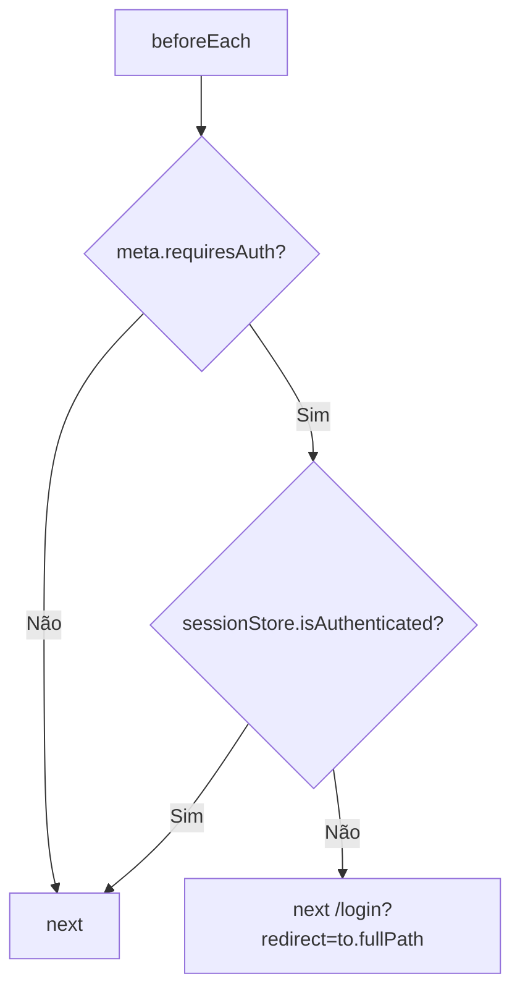

# [2] App Shell — Roteamento e Layout Autenticado

# [2] App Shell — Roteamento e Layout Autenticado

## Objetivo

Implementar o esqueleto da aplicação: router com guards de autenticação, layout autenticado com sidebar e header, e padrões compartilhados de loading/erro.

## Componentes

### `AppLayout.vue`

Layout raiz para rotas autenticadas. Compõe `AppSidebar` e `AppHeader` com um `<RouterView>` central. Não contém lógica de negócio.

### `AppSidebar.vue`

- Links de navegação: Posts, Tags.
- Exibe email do usuário autenticado (da session store).
- Botão de logout que chama `sessionStore.logout()`.

### `AppHeader.vue`

- Título da página atual (via `useRoute().meta.title`).
- Avatar e nome do usuário autenticado.

## Router

### Definição de Rotas

```
/login          → LoginView       (público, meta: { requiresAuth: false })
/mfa-blocked    → MfaBlockedView  (público)
/               → redirect /posts
/posts          → PostsView       (autenticado, meta: { title: 'Posts' })
/posts/new      → PostEditView    (autenticado, meta: { title: 'Novo Post' })
/posts/:id/edit → PostEditView    (autenticado, meta: { title: 'Editar Post' })
/tags           → TagsView        (autenticado, meta: { title: 'Tags' })
```

### Navigation Guard



## Componentes Compartilhados

| Componente | Props | Descrição |
| --- | --- | --- |
| `LoadingSpinner.vue` | `size?` | Indicador de carregamento |
| `EmptyState.vue` | `message`, `icon?` | Estado vazio de listas |
| `ApiErrorAlert.vue` | `error: ApiError \| null` | Exibe erro normalizado da API |
| `BaseButton.vue` | `variant`, `loading?`, `disabled?` | Botão com estado de loading |
| `BaseModal.vue` | `open`, `title` | Modal com slot de conteúdo |
| `BasePagination.vue` | `page`, `total`, `pageSize` | Controles de paginação |

## Composable `useApiError`

Centraliza o tratamento de erros da API:

- Recebe o erro bruto do axios.
- Extrai `detail`, `code` e erros de campo do Pydantic (`422`).
- Expõe `errorMessage: string` e `fieldErrors: Record<string, string>`.

## Cliente HTTP (`api/client.ts`)

- Instância axios com `baseURL = import.meta.env.VITE_API_BASE_URL`.
- **Request interceptor:** injeta `Authorization: Bearer <token>` se `sessionStore.accessToken` existir.
- **Response interceptor:**
  - `401` → `sessionStore.clear()` + `router.push('/login')`.
  - Outros erros → rejeita com objeto normalizado `{ status, detail, code, fieldErrors }`.