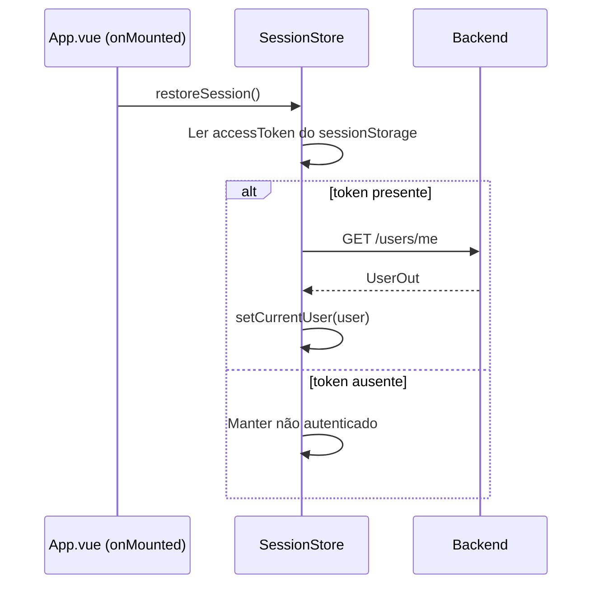

# [3] Auth & Session — Login, MFA e Restauração de Sessão

# [3] Auth & Session — Login, MFA e Restauração de Sessão

## Objetivo

Implementar o fluxo completo de autenticação: login, persistência de sessão, restauração no reload, renovação via refresh token e tratamento de MFA.

## Session Store (Pinia)

**Arquivo:** file:frontend/src/stores/session.ts

### Estado

| Campo | Tipo | Persistência |
| --- | --- | --- |
| `accessToken` | `string \| null` | `sessionStorage` |
| `refreshToken` | `string \| null` | `sessionStorage` |
| `currentUser` | `UserOut \| null` | memória |

### Actions

| Action | Descrição |
| --- | --- |
| `login(email, password)` | Chama `POST /auth/token`, armazena token, chama `loadCurrentUser` |
| `loadCurrentUser()` | Chama `GET /users/me`, popula `currentUser` |
| `refresh()` | Chama `POST /auth/refresh` com `refreshToken`, atualiza `accessToken` |
| `logout()` | Limpa estado e `sessionStorage`, redireciona para `/login` |
| `restoreSession()` | Lê `sessionStorage`, valida token, chama `loadCurrentUser` |

### Getters

| Getter | Tipo | Descrição |
| --- | --- | --- |
| `isAuthenticated` | `boolean` | `accessToken !== null` |
| `userDisplayName` | `string` | `currentUser?.name \|\| currentUser?.email` |

## Fluxo de Restauração no Reload



## Composable `useLogin`

**Arquivo:** file:frontend/src/modules/auth-session/composables/useLogin.ts

Expõe:

- `email: Ref<string>`, `password: Ref<string>`
- `isLoading: Ref<boolean>`, `error: Ref<string | null>`
- `submit(): Promise<void>` — chama `sessionStore.login()`, trata `auth:mfa_required`

## Tratamento de MFA

### Cenário: `auth:mfa_required` no login

O backend atual não emite um challenge de pré-autenticação para MFA no login. Enquanto esse contrato não existir:

1. `useLogin` detecta o código `auth:mfa_required` na resposta de erro.
2. Redireciona para `/mfa-blocked`.
3. `MfaBlockedView` exibe mensagem explicativa e instrução para contato com o administrador.

### Cenário: Setup de MFA (usuário autenticado)

1. Usuário acessa configurações de conta.
2. `POST /auth/mfa/setup` retorna `{ secret, qrcode }`.
3. `MfaSetupModal` exibe QR Code e campo para código de verificação.
4. `POST /auth/mfa/verify` com `{ token }` confirma o setup.

## Tipos TypeScript

**Arquivo:** file:frontend/src/types/auth.ts

```
interface TokenOut { access_token: string; token_type: string }
interface UserOut { id: string; email: string; name: string; is_active: boolean; is_superuser: boolean; mfa_enabled: boolean; roles: string[] }
interface MfaSetupOut { secret: string; qrcode: string }
```