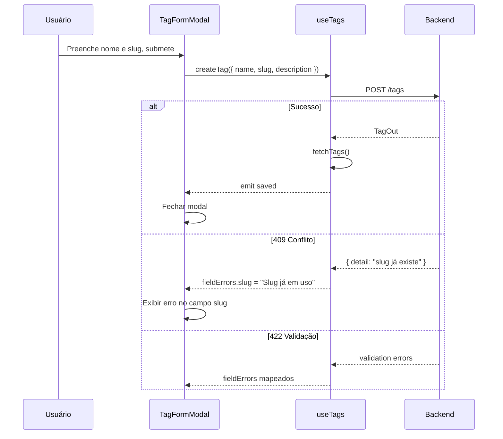

# [4] Content Management — Tags

# [4] Content Management — Tags

## Objetivo

Implementar a interface administrativa completa de tags: listagem paginada, criação, edição e exclusão com feedback de validação.

## Componentes

### `TagsView.vue` (rota `/tags`)

Componente de composição fino. Monta `TagTable` e `TagFormModal`. Não contém lógica de negócio diretamente — delega para `useTags`.

### `TagTable.vue`

Props: `tags: TagOut[]`, `loading: boolean`
Emits: `edit(tag: TagOut)`, `delete(tag: TagOut)`

Exibe tabela com colunas: Nome, Slug, Descrição, Status (ativa/inativa), Ações.

### `TagFormModal.vue`

Props: `open: boolean`, `tag: TagOut | null` (null = criação)
Emits: `saved`, `close`

Formulário com campos: Nome, Slug (auto-gerado a partir do nome), Descrição.
Exibe erros de campo vindos do backend (422) e erro de conflito de slug (409).

## Composable `useTags`

**Arquivo:** file:frontend/src/modules/content-management/composables/useTags.ts

### Estado

| Campo | Tipo | Descrição |
| --- | --- | --- |
| `tags` | `Ref<TagOut[]>` | Lista atual |
| `total` | `Ref<number>` | Total para paginação |
| `page` | `Ref<number>` | Página atual |
| `isLoading` | `Ref<boolean>` | Estado de carregamento |
| `error` | `Ref<ApiError \| null>` | Erro da última operação |

### Métodos

| Método | Descrição |
| --- | --- |
| `fetchTags()` | `GET /tags?page=&page_size=20` |
| `createTag(data)` | `POST /tags` + `fetchTags()` |
| `updateTag(id, data)` | `PATCH /tags/{id}` + `fetchTags()` |
| `deleteTag(id)` | `DELETE /tags/{id}` + `fetchTags()` |

## Fluxo de Criação de Tag



## Tipos TypeScript

**Arquivo:** file:frontend/src/types/tag.ts

```
interface TagOut { id: number; name: string; slug: string; description: string | null; is_active: boolean; created_at: string; updated_at: string }
interface TagCreate { name: string; slug: string; description?: string }
interface TagUpdate { name?: string; description?: string }
```