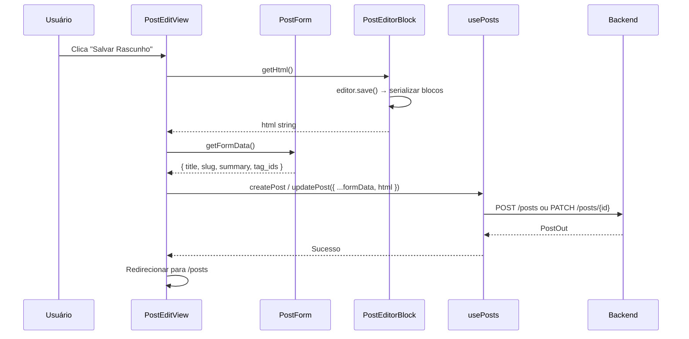
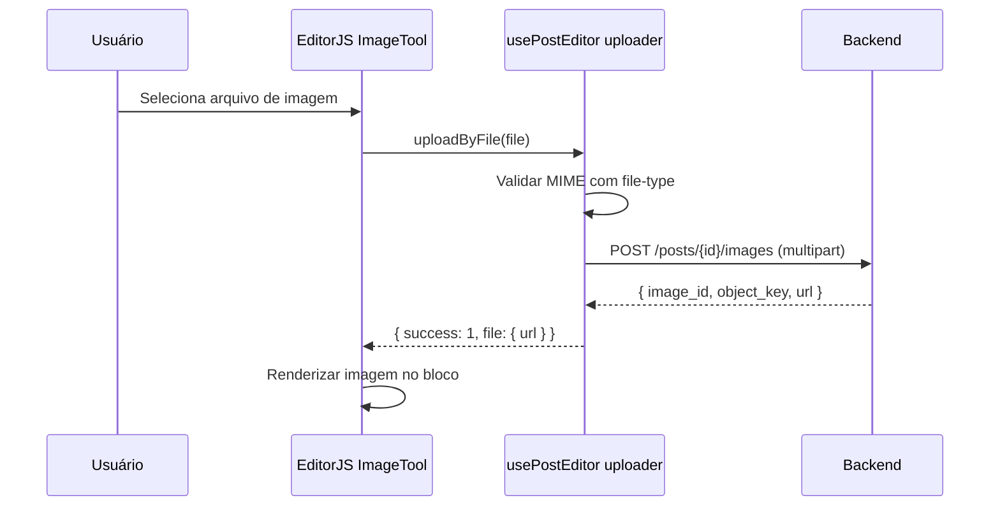

# [5] Content Management — Posts e Editor EditorJS

# [5] Content Management — Posts e Editor EditorJS

## Objetivo

Implementar a listagem de posts com filtros e ações editoriais, e o formulário de criação/edição com editor de conteúdo EditorJS 2.31 integrado ao backend.

## Componentes

### `PostsView.vue` (rota `/posts`)

Composição de `PostFilters` e `PostTable`. Delega para `usePosts`.

### `PostFilters.vue`

Props: `currentStatus: string | null`
Emits: `filter(status: string | null)`

Botões de filtro: Todos | Rascunho | Revisão | Publicado | Arquivado.

### `PostTable.vue`

Props: `posts: PostOut[]`, `loading: boolean`
Emits: `edit(post)`, `publish(post)`, `archive(post)`, `delete(post)`

Colunas: Título, Slug, Status (badge colorido), Tags, Criado em, Ações.

### `PostEditView.vue` (rotas `/posts/new` e `/posts/:id/edit`)

Composição de `PostForm`, `PostEditorBlock` e `PostImageUpload`. Delega para `usePosts` e `usePostEditor`.

### `PostForm.vue`

Props: `post: PostOut | null`, `content: PostContentOut | null`
Emits: `save(data: PostCreate | PostUpdate)`

Campos: Título, Slug, Resumo, Tags (multi-select com tags ativas), Status (readonly).

### `PostEditorBlock.vue`

Wrapper do EditorJS. Inicializa o editor com os blocos convertidos do `html` existente. Expõe `getHtml(): Promise<string>` para o pai serializar antes de salvar.

### `PostImageUpload.vue`

Props: `postId: string`, `images: ImageMeta[]`
Emits: `uploaded(image)`, `removed(imageId)`

Área de upload com preview das imagens já vinculadas ao post.

## Composable `usePosts`

**Arquivo:** file:frontend/src/modules/content-management/composables/usePosts.ts

### Estado

| Campo | Tipo |
| --- | --- |
| `posts` | `Ref<PostOut[]>` |
| `total` | `Ref<number>` |
| `page` | `Ref<number>` |
| `statusFilter` | `Ref<string \| null>` |
| `isLoading` | `Ref<boolean>` |

### Métodos

| Método | Endpoint |
| --- | --- |
| `fetchPosts()` | `GET /posts?page=&page_size=&status=` |
| `fetchPostDetail(id)` | `GET /posts/{id}` + conteúdo MongoDB |
| `createPost(data)` | `POST /posts` |
| `updatePost(id, data)` | `PATCH /posts/{id}` |
| `publishPost(id)` | `POST /posts/{id}/publish` |
| `archivePost(id)` | `POST /posts/{id}/archive` |
| `deletePost(id)` | `DELETE /posts/{id}` |

## Composable `usePostEditor`

**Arquivo:** file:frontend/src/modules/content-management/composables/usePostEditor.ts

Responsabilidades:

- Inicializar instância EditorJS com os plugins configurados.
- Converter `html` string → blocos EditorJS na inicialização.
- Serializar blocos EditorJS → `html` string ao salvar.
- Configurar `ImageTool.uploader.uploadByFile` para chamar `POST /posts/{id}/images`.

### Configuração do ImageTool

O uploader deve:

1. Receber o `File` do EditorJS.
2. Validar MIME com `file-type` antes de enviar.
3. Chamar `api/uploads.ts → uploadImage(postId, file)`.
4. Mapear a resposta `{ image_id, object_key, url }` para `{ success: 1, file: { url } }`.

## Composable `usePostImages`

**Arquivo:** file:frontend/src/modules/content-management/composables/usePostImages.ts

| Método | Endpoint |
| --- | --- |
| `uploadImage(postId, file)` | `POST /posts/{id}/images` (multipart) |
| `deleteImage(postId, imageId)` | `DELETE /posts/{id}/images/{imageId}` |

## Fluxo de Salvar Post com EditorJS



## Fluxo de Upload de Imagem via EditorJS



## Tipos TypeScript

**Arquivo:** file:frontend/src/types/post.ts

```
interface PostOut { id: string; title: string; slug: string; status: string; author_id: string; published_at: string | null; created_at: string; updated_at: string; tags: TagOut[] }
interface PostContentOut { html: string; plain_text: string; summary: string; cover_image: ImageMeta | null; images: ImageMeta[] }
interface PostDetailOut extends PostOut { content: PostContentOut | null }
interface PostCreate { title: string; slug: string; html: string; summary: string; tag_ids: number[] }
interface PostUpdate { title?: string; html?: string; summary?: string; tag_ids?: number[] }
interface ImageMeta { object_key: string; content_type: string; size: number; alt: string }
interface UploadImageOut { image_id: string; object_key: string; url: string }
```

## Gap de Contrato: Conteúdo Editável

O endpoint `GET /posts/{id}` retorna `PostOut` sem `html` nem `images`. O backend já possui o schema `PostDetailOut` com `content: PostContentOut`. O frontend deve:

1. Chamar `GET /posts/{id}` para metadados.
2. Aguardar que o backend expanda esse endpoint (ou adicione `/posts/{id}/detail`) para retornar `PostDetailOut`.
3. Enquanto o gap existir, o editor inicia vazio ao editar posts existentes.