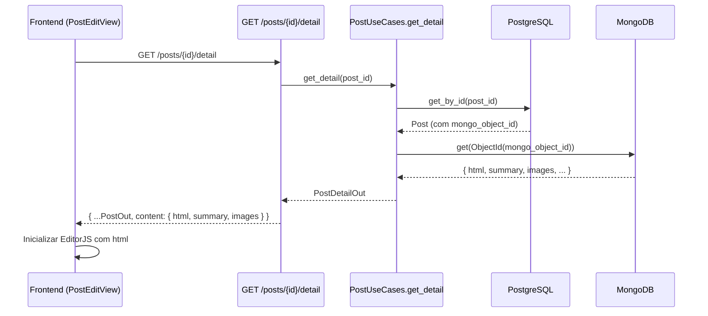
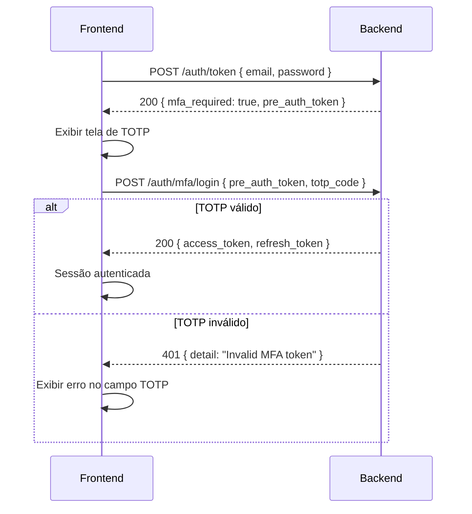

# [Backend] Alinhamento de Contratos para o Frontend Admin

# [Backend] Alinhamento de Contratos para o Frontend Admin

<user_quoted_section>Contexto: Revisão dos gaps de contrato identificados no  (SDD Frontend). Este documento descreve o diagnóstico preciso baseado no código atual e as mudanças mínimas necessárias no backend para desbloquear os fluxos do admin Vue 3.</user_quoted_section>

## Gap 1 — `refresh_token` ausente na resposta de login

### Diagnóstico

**Severidade:** 🟡 Médio — sessão funciona, mas expira sem renovação automática.

O backend já possui toda a infraestrutura necessária:

- file:backend/app/core/config.py já define `jwt_refresh_expiration_days: int = 7`.
- file:backend/app/core/security.py já possui `create_token(sub, email, roles, expires_delta)` que aceita qualquer `timedelta`.
- file:backend/app/presentation/http/routers/auth.py já expõe `POST /auth/refresh` que aceita `{ refresh_token }` e emite novo `access_token`.
- file:backend/app/application/auth/schemas.py define `TokenOut` com apenas `access_token` e `token_type` — **falta o campo ****`refresh_token`**.

O método `login` em file:backend/app/application/auth/use_cases.py chama `create_token` uma única vez e retorna `TokenOut(access_token=token)`. Nenhum refresh token é gerado.

### Mudanças Necessárias

**1. Expandir ****`TokenOut`** em file:backend/app/application/auth/schemas.py:

Adicionar campo opcional `refresh_token: str | None = None` ao schema `TokenOut`.

**2. Emitir refresh token no ****`login`** em file:backend/app/application/auth/use_cases.py:

Após gerar o `access_token`, gerar um segundo token com `expires_delta=timedelta(days=settings.jwt_refresh_expiration_days)` e incluí-lo em `TokenOut`. O payload do refresh token deve conter apenas `sub` (sem `roles` e `email` para minimizar exposição).

**3. Emitir refresh token no ****`verify_mfa`** (mesmo arquivo):

O mesmo padrão deve ser aplicado ao retorno de `verify_mfa`, pois é o outro ponto de emissão de token autenticado.

### Impacto no Frontend

O frontend lê `response.data.refresh_token` e o armazena em `sessionStorage`. Se `null`, opera sem renovação (comportamento atual). A mudança é retrocompatível — campo opcional.

## Gap 2 — `GET /posts/{id}` não retorna conteúdo editável (HTML + imagens)

### Diagnóstico

**Severidade:** 🔴 Alto — sem isso, o editor de posts não pode carregar conteúdo existente.

O backend já possui os schemas corretos em file:backend/app/application/posts/schemas.py:

```
PostContentOut: { html, plain_text, summary, cover_image, images }
PostDetailOut(PostOut): { content: PostContentOut | None }
```

O problema está no use case `get_by_id` em file:backend/app/application/posts/use_cases.py:

```python
async def get_by_id(self, post_id: UUID) -> PostOut:
    post = await self.post_repo.get_by_id(post_id)
    ...
    return PostOut.model_validate(post)  # ← retorna PostOut, não PostDetailOut
```

O método nunca consulta o `content_repo` (MongoDB) para buscar o HTML. O router em file:backend/app/presentation/http/routers/posts.py declara `-> PostOut` como tipo de retorno.

Adicionalmente, o método `get` do `PostContentRepository` em file:backend/app/infrastructure/mongodb/repositories/post_contents.py recebe `ObjectId` mas o use case passa `post.mongo_object_id` como `str` — há uma inconsistência de tipo que precisa ser resolvida junto.

### Mudanças Necessárias

**1. Criar método ****`get_detail`**** no use case** em file:backend/app/application/posts/use_cases.py:

Novo método `get_detail(post_id) -> PostDetailOut` que:

1. Busca o post no PostgreSQL via `post_repo.get_by_id`.
2. Busca o conteúdo no MongoDB via `content_repo.get(ObjectId(post.mongo_object_id))`.
3. Monta e retorna `PostDetailOut` com `content: PostContentOut`.

**2. Adicionar rota de detalhe editorial** em file:backend/app/presentation/http/routers/posts.py:

Adicionar endpoint `GET /posts/{post_id}/detail` com retorno `PostDetailOut`. Manter `GET /posts/{post_id}` retornando `PostOut` para não quebrar clientes existentes.

**3. Corrigir conversão de ****`ObjectId`** em file:backend/app/infrastructure/mongodb/repositories/post_contents.py:

O método `get` deve aceitar `str | ObjectId` e converter internamente com `ObjectId(object_id)` quando necessário.

### Fluxo Após a Correção



## Gap 3 — MFA login sem challenge de pré-autenticação

### Diagnóstico

**Severidade:** 🔴 Alto — decisão arquitetural necessária antes de qualquer implementação.

Este é o gap mais complexo. O fluxo atual em file:backend/app/application/auth/use_cases.py:

```python
async def login(self, data: LoginRequest) -> TokenOut:
    ...
    if user.mfa_enabled:
        raise PermissionDeniedError("auth", "mfa_required")
```

O backend lança `PermissionDeniedError` que vira HTTP 403 com `{ "detail": "Permission denied: auth:mfa_required" }`. O frontend recebe um 403 genérico sem nenhum token temporário para continuar o fluxo de verificação TOTP.

O problema: `POST /auth/mfa/verify` em file:backend/app/presentation/http/routers/auth.py exige `get_current_user` (um `access_token` válido) para identificar o usuário. Mas o usuário com MFA nunca recebe um `access_token` no login — é um deadlock.

O fluxo correto de MFA login requer um **token de pré-autenticação** (pre-auth token): um JWT de vida curta que identifica o usuário mas não concede acesso a rotas protegidas, usado exclusivamente para completar a verificação TOTP.

### Decisão Arquitetural Necessária

Há duas abordagens viáveis:

#### Opção A — Pre-auth token (recomendada)

1. `POST /auth/token` com MFA habilitado retorna HTTP 200 com `{ "mfa_required": true, "pre_auth_token": "<jwt_curto>" }` em vez de 403.
2. Frontend exibe tela de TOTP e envia `POST /auth/mfa/login` com `{ pre_auth_token, totp_code }`.
3. Backend valida o pre-auth token, verifica o TOTP e emite o `access_token` + `refresh_token` definitivos.
4. Requer novo endpoint `POST /auth/mfa/login` e novo schema de resposta de login.

#### Opção B — Estado bloqueado (mínimo viável)

1. Backend mantém o 403 atual mas muda o `detail` para um código estruturado: `{ "detail": "MFA required", "code": "auth:mfa_required" }`.
2. Frontend detecta `code === "auth:mfa_required"` e exibe tela informando que o login com MFA não está disponível ainda.
3. Usuários com MFA habilitado não conseguem logar pelo admin até a Opção A ser implementada.
4. Requer apenas mudança no `error_handlers.py` para incluir `code` na resposta.

### Mudanças por Opção

**Opção A (completa):**

| Arquivo | Mudança |
| --- | --- |
| file:backend/app/application/auth/schemas.py | Novo schema `MfaLoginRequired { mfa_required: bool, pre_auth_token: str }` e `MfaLoginRequest { pre_auth_token: str, totp_code: str }` |
| file:backend/app/application/auth/use_cases.py | `login` retorna `MfaLoginRequired` quando MFA habilitado; novo método `mfa_login(pre_auth_token, totp_code) -> TokenOut` |
| file:backend/app/presentation/http/routers/auth.py | Novo endpoint `POST /auth/mfa/login`; `POST /auth/token` retorna `TokenOut |
| file:backend/app/core/security.py | `create_pre_auth_token(sub, expires_delta=5min)` com claim `type: "pre_auth"` |

**Opção B (mínima):**

| Arquivo | Mudança |
| --- | --- |
| file:backend/app/presentation/http/error_handlers.py | Adicionar `code` extraído da mensagem de `ForbiddenError` na resposta JSON |
| file:backend/app/domain/auth/exceptions.py | `PermissionDeniedError` expõe `code` como atributo separado |

### Fluxo Opção A



### Recomendação

Implementar **Opção B agora** (mudança de 2 arquivos, sem risco) para desbloquear o frontend com estado informativo. Planejar **Opção A** como próxima iteração quando o fluxo de MFA completo for priorizado.

## Gap 4 — Identificador de imagem instável

### Diagnóstico

**Severidade:** 🟢 Baixo — o identificador já é estável, apenas não estava documentado.

Após leitura de file:backend/app/presentation/http/routers/uploads.py:

```python
safe_name = generate_safe_filename()  # secrets.token_urlsafe(32)
object_key = f"upload/post/{post.mongo_object_id}/{safe_name}.{ext}"
return {"image_id": safe_name, "object_key": object_key, "url": url}
```

O `image_id` retornado é o `safe_name` (sem extensão). Os endpoints de download e delete reconstroem o `object_key` como:

```python
f"upload/post/{post.mongo_object_id}/{img_id}"  # ← sem extensão!
```

**Problema real:** o upload salva com extensão (`safe_name.jpg`) mas download/delete buscam sem extensão (`safe_name`). O `object_key` no MinIO não vai bater.

### Mudança Necessária

**Opção simples:** retornar o `object_key` completo como `image_id` e usar diretamente nos endpoints de download/delete, eliminando a reconstrução parcial.

**Opção limpa:** retornar `image_id = f"{safe_name}.{ext}"` (com extensão) e ajustar download/delete para usar `f"upload/post/{mongo_id}/{img_id}"` — o `object_key` bate exatamente.

A **opção limpa** é preferível pois mantém o `image_id` como identificador opaco e estável.

| Arquivo | Mudança |
| --- | --- |
| file:backend/app/presentation/http/routers/uploads.py | `image_id = f"{safe_name}.{ext}"` no retorno do upload |

## Resumo das Mudanças por Prioridade

| Prioridade | Gap | Arquivos Afetados | Esforço |
| --- | --- | --- | --- |
| 🔴 1 | Post detail com conteúdo editável | `use_cases.py` (posts), `routers/posts.py`, `post_contents.py` | Médio |
| 🔴 2 | MFA login — Opção B (estado bloqueado) | `error_handlers.py`, `exceptions.py` | Baixo |
| 🟡 3 | `refresh_token` no login | `schemas.py` (auth), `use_cases.py` (auth) | Baixo |
| 🟢 4 | `image_id` com extensão | `routers/uploads.py` | Mínimo |

## Critérios de Aceite

POST /auth/token retorna refresh_token opcional quando o backend o emite.GET /posts/{id}/detail retorna PostDetailOut com content.html, content.summary e content.images.POST /auth/token com usuário MFA habilitado retorna resposta com code: "auth:mfa_required" identificável pelo frontend.POST /posts/{id}/images retorna image_id com extensão; GET e DELETE de imagem funcionam com o mesmo image_id.